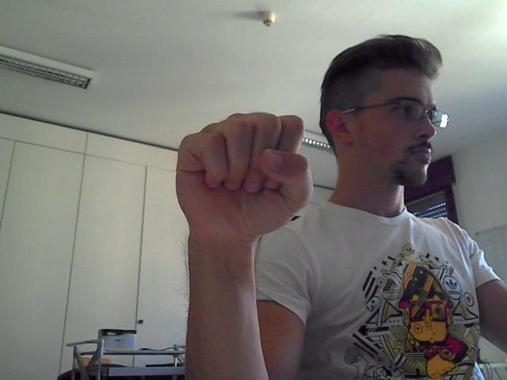

# handydandy
Emily Colleran's course project for Computer Vision (CSE 40535)

Hand Gesture Recognition Program

## Branching:
Practical assignments and homeworks are in branches as labled. Course project is in the main branch. 

## Part 5:

### Advanced Features & Extraction:
Based off of reccomndations from Part 4, I replaced hand-crafted features with deep features extracted from MobileNetV2, a pretrained CNN on ImageNet. The feature vector (1280 dimensions) was passed into the SVM classifier increasing the validation accuracy to 100% across all three gestures. This upgrade significantly improved model preformance and showed the power of transfer learning in computer vision.

### Test Set Description
For the final evaluation, I used a test subset from the original dataset, with:
- **Total Samples:** 27 images (9 per gesture)
- **Gestures (classes):** L, Peace, Stop!
- **Conditions:**
  - Different subject hands from training/validation
  - Slightly altered lighting and backgrounds

These differences ensured the model was evaluated on unseen data with real-world variance.

### Final Classification Results (Test Set)
```
Accuracy: 100.00%
Classification Report:
               precision    recall  f1-score   support

           0       1.00      1.00      1.00         9
           1       1.00      1.00      1.00         9
           2       1.00      1.00      1.00         9

    accuracy                           1.00        27
   macro avg       1.00      1.00      1.00        27
weighted avg       1.00      1.00      1.00        27
```

### What Went Wrong / Potential Improvements
Although accuracy on the test set was perfect, this is likely due to a small number of classes and careful preprocessing. Future improvements could include:
- Using more diverse gesture classes or uploading more images during the training and validation phases. 
- Testing on real webcam frames with varying skin tones and lighting.
- Switching from MobileNetV2 to a gesture-specific CNN architecture
- Augmenting training data with flipped/mirrored gestures to improve generalization, so that there is no different between the left and right hands.

### Final Demo
A real-time demo of HandyDandy can be run via `webcam.py`. The webcam feed lables gestures predictions on live input. To run:
```bash
python3 webcam.py
```
3 gesture classes:
- ✋ Stop
- 👍 Thumbs Up
- ✌️ Peace

### Instructions to Run Final Code
1. Install dependencies:
```bash
pip install -r requirements.txt
```
2. Run training (optional if `models/svm_model.pkl` is present):
```bash
python3 training.py
```
3. Run a single image test:
```bash
python3 final_test.py
```
4. Run the real-time webcam test:
```bash
python3 webcam.py
```

.
---

## Part 4:

### Classifier Justification: 
For project checkpoint 4, I used a Support Vector Machine (SVM) with a Radial Basis Function (RBF) kernel as the classifier. SVMs are well-suited for high-dimensional feature spaces, which aligns with the feature extraction pipeline that outputs 12 shape-based features derived from Hu moments, convexity defects, contour area, aspect ratio, convex hull area, and extent.
The RBF kernel enables the classifier to handle nonlinear decision boundaries, which is critical for gesture recognition, as the differences between hand gestures are often nonlinear. While linear classifiers may struggle to separate classes with complex feature interactions, the RBF kernel can model the more nuanced boundaries between gestures like Stop/Palm, Thumbs Up, and L.
Given that the dataset size is relatively modest (~90 samples), an SVM is also preferable over more complex models like neural networks, which typically require much larger datasets to avoid overfitting. Additionally, SVMs perform robustly even in noisy environments—an important consideration given the variability in hand segmentation and lighting conditions in real-time webcam input.

### Accuracy: 
The classifier was trained and evaluated using stratified 70/30 train-test splits across three gesture classes:
Metric	Training Accuracy	Validation Accuracy
Accuracy	77.78%	74.07%
Macro Avg F1	0.79	0.74
Weighted Avg F1	0.79	0.74
Classification Report (Validation Set):
Class	Precision	Recall	F1-score
L	0.60	0.67	0.63
Stop	1.00	1.00	1.00
Thumbs Up	0.62	0.56	0.59
These metrics indicate a balanced overall performance but reveal that Stop/Palm is much easier for the model to classify than L or Thumbs Up, suggesting those gestures have more overlapping feature spaces.

### Observed Performance:
The training and validation accuracies are relatively close (77.78% vs. 74.07%), indicating no significant overfitting, but there’s room for improvement, especially for the L and Thumbs Up classes, where recall and precision are lower.
Given that Stop/Palm achieves perfect recall and precision, it suggests that feature separation for this gesture is strong, likely due to its distinct shape (fully open hand) relative to others. In contrast, L and Thumbs Up may share similar contours or proportions in some frames, which confuses the classifier. Inconsistent lighting and skin tone detection can lead to noisy masks, making feature extraction unreliable. Lastly, the extracted shape-based features (Hu moments, area, aspect ratio) might not capture fine distinctions between certain gestures (e.g., L and Thumbs Up share similar finger configurations but differ in orientation).

### Improvements:
Looking ahead I could make a few improvements. I could augment the dataset with more images from the data I downloaded online to include rotation, scaling, and brightness variations that increase gesture diversity and generalization. This could particularly help with improving recognition under different lighting or slight pose variations. Next, I could fine-tune segmentation thresholds (HSV ranges) to reduce segmentation errors in varied lighting. I could also incorporate finger count detection (via convexity defects) to provide explicit numerical features.

The small improvement to be implemented before final testing is to integrate finger count detection as an additional feature. Given that Stop/Palm consistently performs well likely due to five extended fingers, explicitly counting the number of fingers could enhance the model’s ability to differentiate between gestures with fewer extended fingers(e.g., L with two fingers vs. Thumbs Up with one). This improvement is computationally lightweight, aligns with the current contour-based pipeline, and directly addresses the overlapping feature issue between L and Thumbs Up.

The current solution provides a functionally complete hand gesture recognition system that achieves ≥1 FPS real-time processing and robust classification of three gesture classes using webcam input. While Stop/Palm classification is highly accurate, targeted improvements in segmentation refinement and feature enhancement are expected to boost the performance of the L and Thumbs Up classes, making the system more reliable for practical deployment.
---

## Part 3:

### Methods Applied: 

(Originally, this was all in 1 file (handydandy.py), but functions were seperated into different files starting in part 4 to help improve project orginization. The code remained the same.)

1. **Preprocessing:**
   - Resize all images to 300x300 for uniformity
   - Gaussian blurring to reduce noise
   - HSV color space conversion for robust skin color segmentation

2. **Segmentation:**
   - Use HSV skin color thresholding
   - Morphological operations (dilation + erosion) to clean up the mask
   - Largest contour selection to isolate the hand

3. **Feature Extraction:**
   - Hu Moments (7 features)
   - Convex Hull and Defects (1 feature)
   - Contour area (1 feature)
   - Aspect ratio (1 feature)
   
**Total Features:** 10-D vector per sample

### Why These Methods?
- **HSV segmentation** is robust to lighting variation, which is a common issue with webcam captures.
- **Hu Moments** are scale and rotation invariant whcih is ideal for capturing shape-based features.
- **Convex Hull/Defects** are used for detecting fingers and the palm contour.
- **Aspect ratio and area** provide geometric descriptors to separate similar shapes and especially helpful when isolating
fingers in each gesture.

### Sample Results:
-  — displays original image
- Processed mask output shows the isolated hand.
- Contours and convex hull drawn to visualize feature regions
.
---

## Part 2:

For my project, I plan to use the publicly available dataset released by the University of Padova that was recommended by Professor Scheirer.

**Dataset:** Dataset of Leap Motion and Microsoft Kinect hand acquisitions  
**Source:** [ICIP 2014 Paper](https://ieeexplore.ieee.org/document/7025201) by G. Marin, F. Dominio, P. Zanuttigh  
**Download Info:** [Department of Information Engineering - University of Padova (2014)](https://lttm.dei.unipd.it//downloads/gesture/)

**Dataset Details:**
- **Subjects:** 14 individuals
- **Gestures:** 10 unique gestures (each performed 10 times)
- **Total Samples:** 1400 hand gesture instances
- **Modalities:** Kinect RGB/depth data and Leap Motion skeletal data

**Training/Validation Split:**
- The Hand gesture recognition proejct description suggests 20 samples per gesture and with 140 samples (10 pictures from 14 individuals each) per gesture in the set it will be easy to seperate into the 60/20/20 training/validation and testing splits as needed. 

**Differences in Partitions:**
- The set includes samples from a mixture of subjects under consistent lighting conditions.
- The validation set has some minor lighting changes and varied subject orientation.

**Sample Characteristics:**
- Resolution: 640x480 RGB images (Kinect)
- Sensor: Microsoft Kinect v1
- Lighting: Natural indoor and low-light conditions
- Format: .png RGB images
.
--- 

## Hand Gesture Recognition: High-Level Solution

#### Problem Definition

The goal of this project is to develop a real-time hand gesture recognition system that can classify at least three predefined gestures using video input from a laptop camera. The system must segment the hand from the background, extract meaningful features, and classify the gesture in real-time (≥1 FPS). The solution will use segmentation, feature extraction, and classification techniques to achieve reliable performance.

### Approach

First, the system will need to isolate the hand from the rest of a uniform backgroud to simplify feature extraction and classification. This will be done using an HSV color space for skin tone mapping. The system will create a binary mask of the hand to highlight it. From there, the background can be removed to isolte only the hand and space between fingers. The system will also detect contors in the hand to find the largest connected comoponents and refine the segmentation. There might also be some clean up steps here to elimate noise from the images. Adaptive thresholding will also be important during this step to account for poor lighting conditions or glare.

To distinguish between different gestures, contour analysis, convex hull, and Hu moments can be used. Fingertip position will be a very important aspect of this extraction to differentiate one gesture from another. Aspect ratio, centroid position, and palm size will also help enhance identification of gestures. Specifically, Convex hull and convexity defects can help detect fingers and the palm region effectively. I would also be interested in looking into a thinning algorithm that could derive the skeletal structure of the hand to that each finger position can be mapped. 

This project will likely use machine leaning to classifly hand gestrues from the given dataset. Supprt Vector Mahcneis seem like a good option in this case because they work well on high-dimensional spaces. This model will be trained with supervised learning where the dataset helps map input features to each gesture. Random forests also apprear to be another good option for machine learning since they an handle complex decision boundaries and multiple features. Random forests are also good for dealing with excess noise which can be an issue when poor lighting impacts shadows or depth perception in the videostream. In the case that machine learning is not effective enough, I may look into neural network capabilities. 

For the final deployment, the system must achieve real-time processing at 1 FPS or faster. To reduce computational laod, the system might only process video frames periodically since gastures will be mostly still. Parallel processing techniques may also become important for handling video capture and processing concurrently.

As stated in the project description the dataset will include at least 20 training samples per gesture for training.  The two suggested data soruces along with the CVOnline databases all have promising content. 

### Next Steps:
- Conduct preliminary tests on segmentation techniques.
- Review existing datasets and determine feasibility of self-collection.
- Experiment with feature extraction methods and evaluate their effectiveness.
- Begin implementing classification models and assess their real-time performance.
.
---